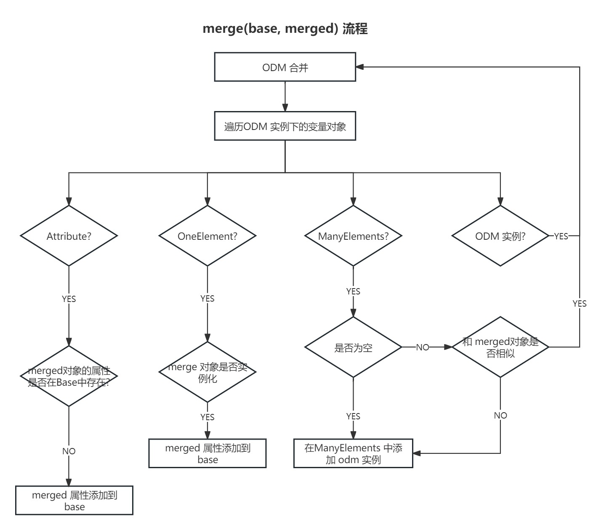

# ODM Class
ODM Class的定义是根据 [ODM V2](https://wiki.cdisc.org/display/ODM2/ODM+v2.0)
## ODM Class 定义方式
### 1. 静态方式(Specification)
 - step1. 定义 ODM Class的代码文件
 - step2. 定义 ODM 元素和ODM Class的映射文件
[示例](https://github.com/thcpc/pyodm/tree/master/example/custom_odm_factory)

### 2. 动态方式(Xsd)
 - step1. 定义 XSD 文件
 - Factory 调用时会动态生成
 
## 成员变量
成员变量主要有三种类型
- Attribute
- OneElement
- ManyElements
### Attribute()
#### 定义
定义改成员变量为属性

#### API
| Name | 成员类型 | 含义 |
| --- | ----- | ---- |
| get_name | method | 获取 Attribute 名 |
| get_value | method | 获取 Attribute 的值 |
| set_name | method | 设置 Attribute 名 |
| set_value | method | 设置 Attribute 的值 |

### OneElement()
#### 定义
定义该成员变量为 该子元素只有一个

- ? (meaning optional, with zero or one occurrence)
#### API
| Name | 成员类型 | 含义 |
| --- | ----- | ---- |
| get_name | method | 获取 Element 名 |
| get_value | method | 获取 Element 的值，无返回 None |
| set_name | method | 设置 Element 名 |
| set_value | method | 设置 Element 的值 |
| is_blank | method | 返回该元素是否有文本 |
### ManyElements()
#### 定义
定义该成员变量的子元素可能有多个
![[Pasted image 20231124143855.png]]
- * (meaning optional, with zero or more occurrences)
- + (meaning required, with one or more occurrences)
#### API
| Name | 成员类型 | 参数 |含义 |
| --- | ----- | ---- | --- |
| get_name | method | 获取 Element 名 |
| get_value | method | 获取 Element 的值，无返回 None |
| set_name | method | 设置 Element 名 |
| set_value | method | 设置 Element 的值 |
| array | property| 无 |返回该元素的列表|
| count | property| 无 | 元素个数 |
| index| method | int i |返回 指定位置的元素 |
| first| method | 无 | 返回 第一个元素 |
| find | method | \*\*attributes | 返回符合属性的第一个 | 

# 主要的功能类说明

## Factory


### odm_process 方法流程图

## Loader

## Reader

## Source


## 依赖关系


## ODM 对象的操作

### append
只针对 ManyElements 元素,针对该 Element类型,新增一个Element

### merge
前提是 被合并对象 odm_element 与 合并对象的 根节点一致


### add
添加 ElementEntity 到 OneElement
前提:
 1. 新增的 OneElement 存在
 2. OneElement 还没有被实例化

### replace
替换指定的子元素
1. 子元素为 OneElement 和 实例直接替换
2. 子元素为 ManyElements
    - 为空，则直接添加
    - 不为空，查找相似的替换

### update
更新 ODM 属性

### update_text
更新 ODM 的文本

# 应用场景
## 读取标准的 ODM data 的XML文件
[示例数据 Example1 ](https://wiki.cdisc.org/display/ODM2/ItemGroupData)
- [CdiscXsdFactory](https://github.com/thcpc/pyodm/tree/master/example/xsd_factory)
- [CdiscSpecificationFactory](https://github.com/thcpc/pyodm/tree/master/example/specification_factory)

## 数据库中读取数据，并生成XML文件
[CdiscListableFactory](https://github.com/thcpc/pyodm/tree/master/example/database)
## 自定义结构，并读取 XML 数据
[示例](https://github.com/thcpc/pyodm/tree/master/example/custom_odm_factory)

## 从 JSON 中读取文件 ODM 数据
[示例](https://github.com/thcpc/pyodm/tree/master/example/json_factory)


# Forest

自定义数据结构, 把传入的列表数据转为为树形结构
根据传入的列表，生成不同可能生成多个树

#### 类型

##### 单树

###### 输入

```python
branches = [
    [dict(id=1), dict(id=2),dict(id=3)],
    [dict(id=1), dict(id=2),dict(id=3),dict(id=6)],
    [dict(id=1), dict(id=2),dict(id=3),dict(id=7)],
    [dict(id=1), dict(id=4),dict(id=5)]
]
```

###### 输出


##### 多棵树

###### 输入

    branches = [
        [dict(id=1), dict(id=2),dict(id=3)],
        [dict(id=1), dict(id=2),dict(id=3),dict(id=6)],
        [dict(id=A1), dict(id=A2),dict(id=A3),dict(id=A7)],
        [dict(id=A1), dict(id=A4),dict(id=5)]
    ]

###### 输出


#### 术语描述

##### degree

该结构下，最大的树的Degree

##### level

Forsest 的层级，level = degree-1 

##### branches

多维数组

```python
branches = [
    [dict(id=1), dict(id=2),dict(id=3)],
    [dict(id=1), dict(id=2),dict(id=3),dict(id=6)],
    [dict(id="A1"), dict(id="A2"),dict(id="A3"),dict(id="A7")],
    [dict(id="A1"), dict(id="A4"),dict(id=5)]
]
```

每一行都表示为一个从根节点到叶子节点的一个分支。

# Release

## Release 1.0.0
1. 根据 XSD 配置，读取 ODM XML 数据，生成 ODM 对象
2. 根据 ODM Class 定义，读取 ODM XML 数据，生成 ODM 对象
3. 读取 数据库数据， 转化为 ODM 对象 
4. ODM 对象，导出为 XML
## Release 1.0.1
增加了ReadME
## Release 1.0.2
增加了ReadME

## Release 1.0.3
1. 修改了 ODM 对象 获取 name 或 text 的方法为get_name(),set_name(),get_value(),set_value()
2. 增加了 as_stream 来查询ODM对象

## Release 1.0.3.1

1. 修改了 odm_dfs 搜索会忽略掉 odm 对象的BUG
2. 修改了 merge 时，会忽略掉 odm 对象 的 BUG
3. 新增了 replace 操作

## Release 1.0.3.2

1. 新增了 add 操作

## 未来计划
1. JSON 格式的 ODM 数据支持
2. ODM 输入到数据库
3. ODM 通过接口导入
4. ODM 对象 多线程，多数据源读取
5. ODM 对象操作：append, replace, join
6. ManyElements 的 each, find_all 等功能函数

