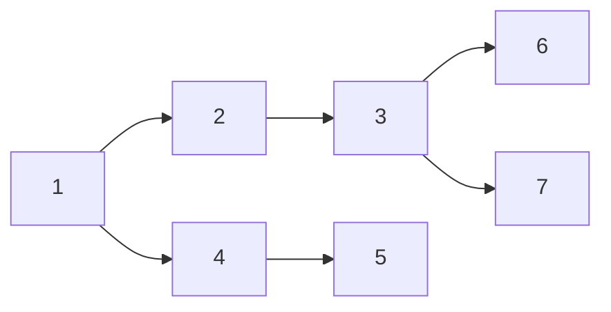
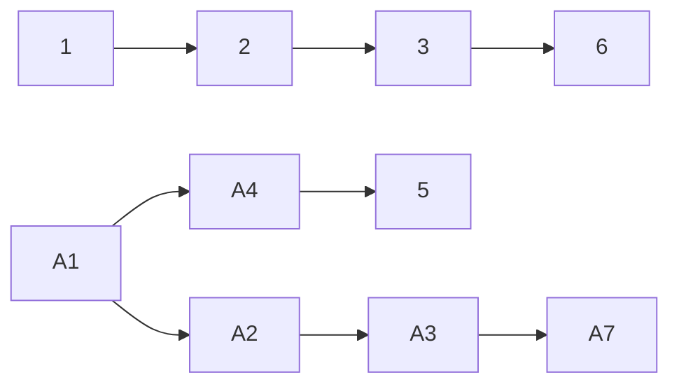

## Features

- core
  
  读取 XSD 文件，读取 ODM XML 文件的实现

- factory
  
  定义了 生成ODM对象的工厂对象

- model
  
  ODM 模型的数据类型

- utils
  
  辅助的工具方法

## core

### AbstractDataReader

读去数据的抽象方法，定义抽象方法 read()

### AbstractXMLDataReader

读取 XML 文件的实现

### CdiscDataSpecificationReader

根据 Specifincation的方式，读取XML数据， 实例化 ODM 对象

### CdiscDataXsdReader

根据 XSD 的方式，读取XML数据， 实例化 ODM 对象

### AbstractConfigurationReader

读取配置文件的抽象方法定义，load_cdisc_definition()

### CdiscConfigurationSpecificationReader

读取 Specifincation 配置文件

定义例子如下

```xml
<CDISC>
    <ODM modulePath="pyodm.model.v2.cdisc.ODM" clazz="ODM"/>
    <AuditRecord modulePath="pyodm.model.v2.cdisc.AuditRecord" clazz="AuditRecord"/>
    <ClinicalData modulePath="pyodm.model.v2.cdisc.ClinicalData" clazz="ClinicalData"/>
    <DateTimeStamp modulePath="pyodm.model.v2.cdisc.DateTimeStamp" clazz="DateTimeStamp"/>
    <ItemData modulePath="pyodm.model.v2.cdisc.ItemData" clazz="ItemData"/>
    <ItemGroupData modulePath="pyodm.model.v2.cdisc.ItemGroupData" clazz="ItemGroupData"/>
    <LocationRef modulePath="pyodm.model.v2.cdisc.LocationRef" clazz="LocationRef"/>
    <Query modulePath="pyodm.model.v2.cdisc.Query" clazz="Query"/>
    <ReasonForChange modulePath="pyodm.model.v2.cdisc.ReasonForChange" clazz="ReasonForChange"/>
    <SourceID modulePath="pyodm.model.v2.cdisc.SourceID" clazz="SourceID"/>
    <SubjectData modulePath="pyodm.model.v2.cdisc.SubjectData" clazz="SubjectData"/>
    <UserRef modulePath="pyodm.model.v2.cdisc.UserRef" clazz="UserRef"/>
    <SiteRef modulePath="pyodm.model.v2.cdisc.SiteRef" clazz="SiteRef"/>
    <StudyEventData modulePath="pyodm.model.v2.cdisc.StudyEventData" clazz="StudyEventData"/>
    <Value modulePath="pyodm.model.v2.cdisc.Value" clazz="Value"/>

</CDISC>
```

### CdiscConfigurationXsdReader

读取 ODM XSD 格式的配置文件  [CDISC ODM标准2.0 XSD](https://github.com/cdisc-org/DataExchange-ODM/tree/main/schema)

### CdiscXmlWriter

ODM 对象导出为 XML 文件


## factory

### CdiscRegistry

注册 ODM 元素的 Class 类型

### AbstractCdiscFactory

生成ODM的抽象工程类型

### AbstractCdiscXMLFactory

通过 XML 生成ODM的工程对象的类型，定义了生成模板

1. 获取 Class 类型 class_reader

2. 读取 XML 文件转化为ODM 对象  data_reader

### CdiscSpecificationFactory

Class 类型的对象定义在Specification 中

### CdiscXsdFactory

Class 类型的定义在XSD文件中

## model

### Attribute

ODM 标准中对应的 Element 的 Attribute属性

### OneElement

- ? (meaning optional, with zero or one occurrence)
  
  对应表示为？的子元素
  
  

### ManyElements

- /* (meaning optional, with zero or more occurrences)
- /+ (meaning required, with one or more occurrences)

     对应标识为*或+的子元素

### CdiscODMEntity

自定义ODM的元素的时候，必须继承的元类


## utils

### Forest

自定义数据结构, 把传入的列表数据转为为树形结构
根据传入的列表，生成不同可能生成多个树

#### 类型

##### 单树

###### 输入

```python
branches = [
    [dict(id=1), dict(id=2),dict(id=3)],
    [dict(id=1), dict(id=2),dict(id=3),dict(id=6)],
    [dict(id=1), dict(id=2),dict(id=3),dict(id=7)],
    [dict(id=1), dict(id=4),dict(id=5)]
]
```

###### 输出



##### 多棵树

###### 输入

    branches = [
        [dict(id=1), dict(id=2),dict(id=3)],
        [dict(id=1), dict(id=2),dict(id=3),dict(id=6)],
        [dict(id=A1), dict(id=A2),dict(id=A3),dict(id=A7)],
        [dict(id=A1), dict(id=A4),dict(id=5)]
    ]

###### 输出



#### 术语描述

##### degree

该结构下，最大的树的Degree

##### level

Forsest 的层级，level = degree-1 

##### branches

多维数组

```python
branches = [
    [dict(id=1), dict(id=2),dict(id=3)],
    [dict(id=1), dict(id=2),dict(id=3),dict(id=6)],
    [dict(id=A1), dict(id=A2),dict(id=A3),dict(id=A7)],
    [dict(id=A1), dict(id=A4),dict(id=5)]
]
```

每一行都表示为一个从根节点到叶子节点的一个分支。

# Release

## Release 1.0.0-beta

第一版本,内测

## Release 1.0.0-beta1

增加了Node 模糊匹配 

## Release 1.0.0-beat2

增加了Node 模糊匹配,更新了关联方法

## Release 1.0.0-beat3

增加了 ODM 生成 Factory 对象
