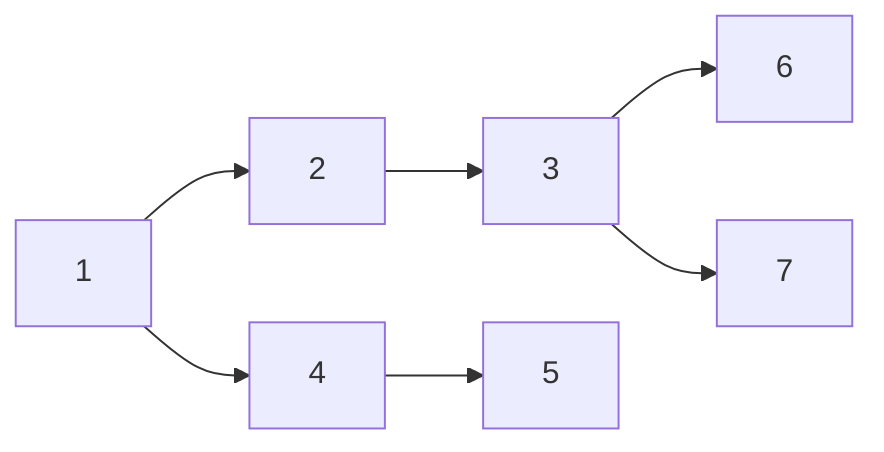
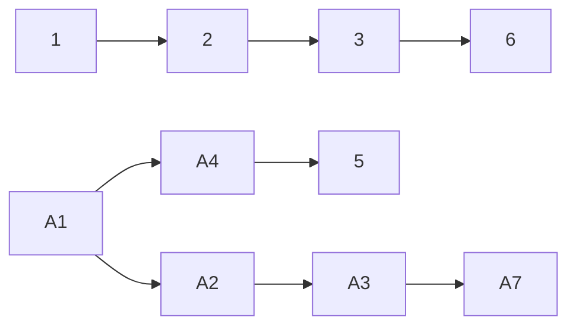

## Forest

自定义数据结构, 把传入的列表数据转为为树形结构
根据传入的列表，生成不同可能生成多个树

## 类型

### 单树

#### 输入

```python
branches = [
    [dict(id=1), dict(id=2),dict(id=3)],
    [dict(id=1), dict(id=2),dict(id=3),dict(id=6)],
    [dict(id=1), dict(id=2),dict(id=3),dict(id=7)],
    [dict(id=1), dict(id=4),dict(id=5)]
]
```


#### 输出




### 多棵树

#### 输入

    branches = [
        [dict(id=1), dict(id=2),dict(id=3)],
        [dict(id=1), dict(id=2),dict(id=3),dict(id=6)],
        [dict(id=A1), dict(id=A2),dict(id=A3),dict(id=A7)],
        [dict(id=A1), dict(id=A4),dict(id=5)]
    ]

#### 输出




## 术语描述

### degree

该结构下，最大的树的Degree

### level

Forsest 的层级，level = degree-1 


### branches

多维数组

```python
branches = [
    [dict(id=1), dict(id=2),dict(id=3)],
    [dict(id=1), dict(id=2),dict(id=3),dict(id=6)],
    [dict(id=A1), dict(id=A2),dict(id=A3),dict(id=A7)],
    [dict(id=A1), dict(id=A4),dict(id=5)]
]
```

每一行都表示为一个从根节点到叶子节点的一个分支。

# Release
## Release 1.0.0-beta
第一版本,内测
